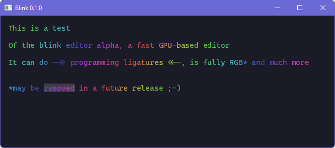

# blink

Fast and light text and code editor, made with ☕, C++ 17, and OpenGL

## Screenshot

## Compiling

The editor was tested and verified to work under Windows 11 and macOS Monterey.

You need to download the FreeType and Harfbuzz libraries to the `lib` folder, then you can compile it using CMake.